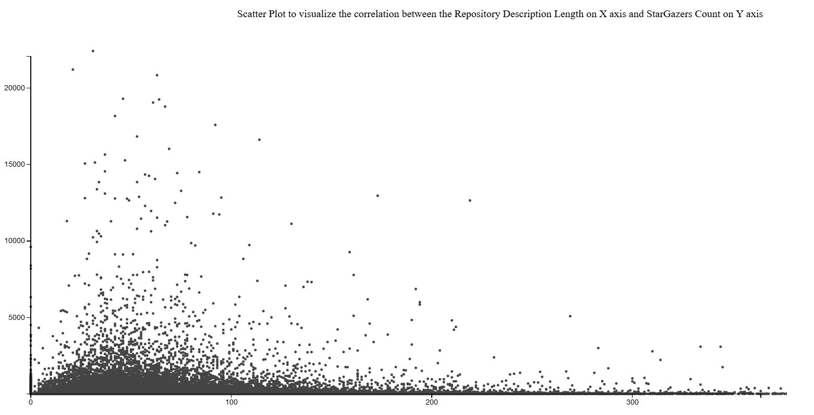
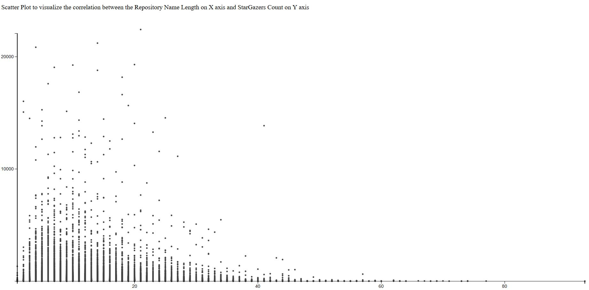
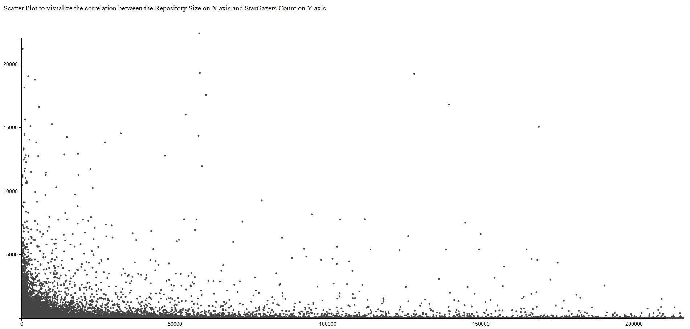

# StarHub

### Installation
```js
npm install
```

<br>

### Correlation results (covariance / stdev)

* correlation between repo size and stargazers_count:
`0.011688510188864406`

* correlation between owner username length and stargazers_count: `-0.013177102797976655`

* correlation between repoInfo.length and stargazers_count: `-0.026801009317331707`

* correlation between image count and stargazers_count: `0.07727884132110648`

* correlation between description length and stargazers_count: `0.005792431979289031`

* correlation between sectionCount and stargazers_count: `0.0791952217258178`

<br>

### Visualizations:






<br>

### What we're looking for in Read-me files:

The Github returned content is base64 decode it first.

  * Number of sections
  - [x] readme file type (markdown, txt, etc)

  - [x] Length (you can get it from Github API: /api/ response.size)
  - [x] Not currently functioning Number of images used [image-array.js](image-array.js)
  - [x] Links [link-array.js](link-array.js)
    - [x] array of links
    - [x] number of links
  - [x] Word count (frequency): https://tonicdev.com/56c24183e3023b0d005535b1/56e1031073f4dc1100edbd3a
  - [x] Section Count [sectionCount.js](sectionCount.js)

  * [Stretch] is there a code sample? How many bytes of code samples are there?
  * [Stretch] Badge count (extension of Links finding above)
  * [Stretch] Links to other Github users
